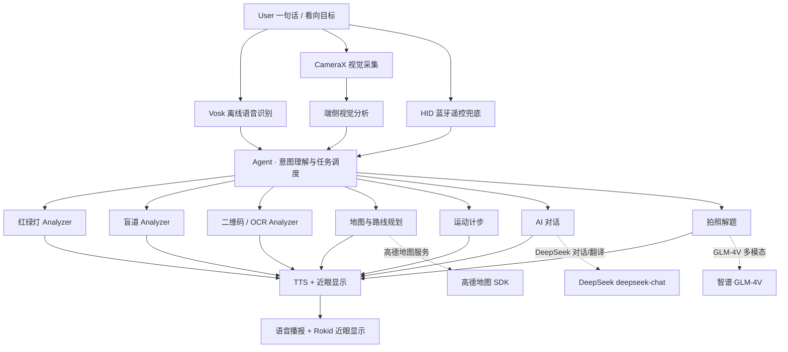

# Horizon AI Glasses

> AI-powered smart glasses assistant for hands-free, context-aware interaction.

简体中文 · [English](./README_EN.md)


---

**Horizon AI Glasses（地平线 · 智能视界）** 是一套运行在 **Android 手机 + Rokid AI 眼镜** 上的**语音优先、端云协同**智能眼镜助手。

佩戴眼镜时，双手和视线往往都被占用。本项目把"看见"和"理解"重新合并到视线之内：用户只需说一句话，系统便完成**意图理解与任务调度**，在 Vosk 离线语音识别、TensorFlow Lite 端侧视觉、DeepSeek / 智谱大模型与高德地图之间分发能力，并通过 **TTS 语音播报**与**近眼显示**返回结果——不掏手机、不低头。

当前版本已完成眼镜连接、中英文离线语音识别、红绿灯与盲道检测、地图定位与路线规划、拍照解题、翻译与同声传译等核心链路联调，共 **27 个语音动作** 由统一入口调度。

---

## Demo / 产品预览

**Android 应用界面**（真实设备运行截图）


<details>
<summary><b>🎬 打开 Demo 演示（点击展开）</b></summary>

**完整功能演示视频**（点击播放）：

<video src="docs/video/Horizon AI Glasses.mp4" controls width="100%"></video>

**App 功能截图**（再次点击上方标题即可收起）：

| 盲道识别（端侧） | 文字翻译 | 拍照解题（GLM-4V） |
| :---: | :---: | :---: |
|  |  |  |

| 高德地图定位 | 路线规划与导航 |
| :---: | :---: |
|  |  |

</details>

> 截图说明：均为 Android 手机端应用界面截图；眼镜端通过 CXR-M SDK 接收自定义视图进行近眼显示。

---

## Why Horizon AI Glasses

传统移动端信息获取，通常是一条很长的操作链：

```text
拿出手机 → 打开应用 → 寻找功能 → 对准目标 → 等待结果 → 低头确认
```

对佩戴眼镜、双手被占用的用户（骑行、视障出行、跨语言交流、实验操作）来说，这条链路每一步都是负担。

Horizon AI Glasses 希望把它压缩成：

```text
说一句话 / 看向目标
        ↓
系统理解任务（本地规则 + LLM 意图分析）
        ↓
Agent 调用对应能力（端侧识别 / 云端大模型 / 地图服务）
        ↓
语音播报 + 近眼显示 反馈结果
```

设计原则很简单：**隐私敏感、要求实时的任务留在端侧；复杂对话与重算交给云端。**

---

## Core Features

以下能力均可在源码中找到对应实现（详见 `app/src/main/java/com/blue/glassesapp/`）。

### 🚦 无障碍出行（端侧）
- **红绿灯识别**：TensorFlow Lite 加载 YOLOv8 float32 模型，识别红/绿/黄灯；实现 Letterbox 预处理、置信度阈值、NMS 与**连续 3 帧稳定判定**，抑制单帧误检。
- **盲道识别**：TensorFlow Lite 加载 int8 量化模型，计算盲道中心相对画面中心的偏离量，生成"在盲道上 / 左手 X 米处 / 右手 X 米处"方向提示。
- 以上均在设备端完成，原始画面不离开设备，离线可用。

### 🌐 跨语言沟通（云端）
- **文字翻译**：CameraX 取帧 → ML Kit 中文 OCR → DeepSeek `deepseek-chat` 翻译，结果 TTS 播报。
- **同声传译**：Vosk 切换英文模型持续识别，实时翻译并播报，说"out / 关闭同传"退出。

### 🗺️ 地图与导航（云端 SDK）
- 高德地图：定位、POI 搜索、驾车路线规划、路线绘制，支持 **2D / 3D 视角切换**（3D 视角跟随车头方向），路线结果经 TTS 播报。
- 说明：当前实现为"地图 + 路线规划 + 2D/3D 视角"，尚未接入高德导航（Navi）SDK 的逐向语音引导，见 [Project Status](#project-status)。

### 🤖 AI 对话与拍照解题（云端）
- **AI 对话**：DeepSeek `deepseek-chat`（`temperature` 0.7 对话 / 0.3 意图抽取）。
- **拍照解题**：智谱 **GLM-4V-plus** 多模态模型，图片 JPEG 压缩后 Base64 上传，同时理解图像与文字并给出分步解答。

### 🎤 语音交互闭环（端侧）
- **Vosk 离线中英文识别**：AudioRecord 采集 16kHz 单声道 PCM，RMS 能量检测 + 静音超时判定一句话结束，识别过程中持续输出。
- **TTS 与识别协调**：播报开始时暂停录音、结束后恢复，避免"抢麦"。
- **降噪**：`WebRtcNoiseProcessor` 基于能量门限的语音活动检测（VAD）进行噪声门控（注：因 WebRTC Java API 限制，采用 VAD 备用方案，见源码注释）。

### 💳 扫码支付
- ML Kit 条形码扫描，对准付款码即可识别，语音开启 / 关闭。

### 🏃 运动与健康
- 计步：基于加速度传感器（`VoiceTranslationManager` 简化版）与 `STEP_COUNTER / STEP_DETECTOR` 传感器（`SportTrackingActivity`），估算距离。
- 健康展示：当前为**模拟演示数据**（心率 / 血氧 / 疲劳度），非真实生理指标。

### 📒 记录管理
- GreenDAO 本地数据库保存每次语音指令、识别动作、时间与结果状态，支持历史查询。

---

## How the Agent Works

> Agent 在本项目中的定位是：**任务理解、能力调度与流程编排中枢**——而非"全自主智能体"。

```text
语音输入
   ↓
Vosk 离线语音识别（16kHz / RMS 静音检测 / 中英文模型）
   ↓
意图理解
   ├── 本地规则快速匹配（高频指令：运动 / 3D 导航 / 退出同传…）
   └── DeepSeek 意图分析（LLM 从 27 个预定义动作中选择，仅上传识别文本）
   ↓
任务路由（executeIntent）
   ↓
工具调用
   ├── 端侧：红绿灯 / 盲道 / 二维码 / OCR / 计步 / TTS
   └── 云端：DeepSeek 对话与翻译 / 智谱解题 / 高德导航
   ↓
结果表达（TTS 语音播报 + 近眼显示）
```

关键设计：

- **两级意图策略**：高频指令本地直接匹配（低延迟、零成本），未匹配指令交由 DeepSeek 从**预定义动作集合**中选择。**大模型只负责语义理解，实际执行仍由代码控制**，行为可控、可回退。
- **最小数据原则**：意图分析仅上传识别文本，不上传原始音频；解题仅上传压缩后的单张题目图，不上传连续画面。
- **27 个动作**：`translate`、`simultaneous`、`navigate`、`navigate_3d`、`pay`、`traffic_light`、`blind_road`、`solve_problem`、`start_chat`、`take_photo`、`toggle_recording`、`start_sport`、`show_map`、`close_all` 等（完整列表见 [`docs/architecture/voice-actions.md`](docs/architecture/voice-actions.md)）。

---

## System Architecture

系统采用自下而上的四层架构：



| 层 | 职责 | 真实技术 |
| --- | --- | --- |
| 应用层 | 面向场景的功能组织 | Home / 实时翻译 / 运动 / 遥控器页面，27 个语音动作 |
| 智能理解层 | 意图理解、任务路由 | 本地规则 + DeepSeek 意图分析 |
| 基础能力层 | 具体能力输出 | Vosk · ML Kit · TensorFlow Lite · TTS · WebRTC-VAD |
| 设备连接层 | 数据来源与交互 | CXR-M SDK · 蓝牙 HID · CameraX · SensorManager |

分层的收益是**能力复用**：一套 CameraX 采集同时支撑预览 / 分析 / 录像，一套 TTS 同时服务导航 / 红绿灯 / 盲道 / 翻译 / 对话播报，一套 GreenDAO 同时服务记录查询与业务数据。

架构细节见 [`docs/architecture/architecture.md`](docs/architecture/architecture.md)。

---

## Edge-Cloud Collaboration

端云分工是项目的核心设计决策，依据 **延迟 / 数据敏感度 / 能力上限** 三个维度划分：

| 能力 | 端 / 云 | 实现 | 分工理由 |
| --- | --- | --- | --- |
| 语音识别 | 端 | Vosk + AudioRecord | 免提输入需低延迟与离线可用；原始音频含个人语音信息 |
| 红绿灯 / 盲道识别 | 端 | YOLOv8 TFLite | 实时提示需低延迟；原始画面含环境与行人信息 |
| 二维码 / OCR | 端 | ML Kit | 部署简单、实时分析，无需上传原始画面 |
| 语音合成 | 端 | Android TTS | 结果反馈通道，须即时 |
| 计步 | 端 | 加速度 / STEP 传感器 | 本地传感器数据，无需上云 |
| 对话 / 意图分析 | 云 | DeepSeek `deepseek-chat` | 依赖大模型语言能力，**仅上传识别文本** |
| 翻译 / 同传 | 云 | DeepSeek API | 依赖大模型翻译能力 |
| 拍照解题 | 云 | 智谱 GLM-4V | 依赖多模态图文推理，**仅上传单张题目图** |
| 地图 / 路线规划 | 云 | 高德 SDK | 依赖专业地图数据与服务 |

**离线兜底**：网络中断时，红绿灯、盲道、二维码、基础 OCR 与语音识别仍可维持核心体验；网络恢复后再启用云端对话与解题。

---

## Technology Stack

| 领域 | 技术 | 用途 |
| --- | --- | --- |
| 平台 | Android（minSdk 28 / targetSdk 33 / compileSdk 36）· Kotlin 2.1 | 应用主体 |
| 设备 | Rokid CXR-M SDK 1.0.3 · 蓝牙 HID | 眼镜连接、近眼显示、遥控 |
| 语音 | Vosk（Kaldi）中英文离线模型 · Android TTS | 离线识别 / 合成 |
| 视觉 | CameraX · ML Kit（中文 OCR + 条码）· TensorFlow Lite | 采集 / OCR / 二维码 |
| 模型 | YOLOv8（红绿灯 float32 + 盲道 int8，TFLite） | 端侧目标检测 |
| 云端 AI | DeepSeek `deepseek-chat` · 智谱 GLM-4V-plus | 对话 / 意图 / 翻译 / 解题 |
| 地图 | 高德地图 SDK（3D 地图 + 搜索 + 定位） | 定位 / POI / 路线 |
| 数据 / UI | GreenDAO · QMUI · EventBus · Glide | 本地记录 / 界面 |

---

## Project Structure

```
Horizon-AI-Glasses/
├── app/                          # Android 应用模块
│   ├── src/main/java/com/blue/glassesapp/
│   │   ├── core/                 # 基础能力：CXR 连接、蓝牙 HID、数据库、权限、工具
│   │   ├── common/               # 公共模型、数据绑定、Widget
│   │   └── feature/
│   │       ├── init/             # 启动页
│   │       ├── scanblueroorh/    # 蓝牙扫描配对
│   │       └── home/             # 主界面：语音调度、视觉分析、翻译、导航、运动
│   ├── src/main/assets/
│   │   ├── model/ model_en/      # Vosk 中英文模型（Git 不追踪，见配置文档）
│   │   ├── blindpath/            # 盲道 int8 模型（已追踪）
│   │   └── traffic/              # 红绿灯 float32 模型（已追踪）
│   └── src/main/res/             # 布局 / 资源 / raw（含 Rokid 鉴权占位文件）
├── gradle/                       # Gradle wrapper + 版本目录
├── docs/
│   ├── images/                   # README 展示用真实截图
│   ├── architecture/             # 架构说明、语音动作清单
│   ├── development/              # 构建 / 配置 / SDK 文件说明
│   └── competition/              # 比赛资料（项目报告等）
├── README.md / README_EN.md
├── LICENSE / SECURITY.md / CONTRIBUTING.md / THIRD_PARTY_NOTICES.md
└── build.gradle / settings.gradle / gradle.properties
```

---

## Getting Started

### 环境要求

| 项 | 要求 |
| --- | --- |
| JDK | 17 及以上（AGP 8.9.1 要求） |
| Android Studio | 支持 AGP 8.9 / Gradle 8.11.1 的版本 |
| Android SDK | `compileSdk 36`，`minSdk 28`（Android 8.0+） |
| 设备 | arm64-v8a Android 手机（真机） |
| 眼镜 | Rokid Glasses + CXR-M SDK 鉴权（`.lc` 文件 + `CLIENT_SECRET`） |

### 步骤

```text
1. Clone 仓库
2. 用 Android Studio 打开工程
3. 还原必需 SDK / 模型文件（见下方与 docs/development/）
4. 配置 local.properties（复制 local.properties.example）
5. 连接 Android 真机（arm64）
6. 构建并安装
```

### 还原必需 SDK / 模型文件

由于许可证与体积限制，以下文件**不在本仓库中**（`THIRD_PARTY_NOTICES.md` 有说明），构建前需按 [`docs/development/required-sdk-files.md`](docs/development/required-sdk-files.md) 放入指定目录：

| 文件 | 放置目录 | 获取渠道 |
| --- | --- | --- |
| 高德地图 SDK AAR | `app/src/main/assets/maps/` | 高德开放平台 |
| 高德 SDK 原生库（`libAMapSDK_NAVI*.so`、`libapssdk.so` 等） | `app/src/main/jniLibs/arm64-v8a/` | 高德开放平台 |
| Rokid 原生库（NeonUI / nui / openssl 等） | `app/src/main/jniLibs/arm64-v8a/` | Rokid 开发者门户 |
| Rokid 设备鉴权 `.lc` 文件 | 替换 `app/src/main/res/raw/a1e15aabfb1e4a88bbaf97e31121a84b.lc`（当前为占位文件） | Rokid 开发者门户 |
| Vosk 中文模型 | `app/src/main/assets/model/` | alphacephei.com/vosk/models |
| Vosk 英文模型 | `app/src/main/assets/model_en/` | alphacephei.com/vosk/models |

> 盲道（`blindpath/`）与红绿灯（`traffic/`）两个 TFLite 模型为本项目自训练模型，已随仓库分发。

### 构建

```bash
# Windows
gradlew.bat assembleDebug
# macOS / Linux
./gradlew assembleDebug
```

---

## Configuration

云能力（对话、翻译、解题、地图、眼镜鉴权）需要密钥。**密钥仅写入本机 `local.properties`（已被 git 忽略），绝不提交。**

```bash
cp local.properties.example local.properties   # 然后填入自己的 Key
```

```properties
DEEPSEEK_API_KEY=your_deepseek_api_key_here      # DeepSeek：对话 / 翻译 / 同传 / 意图分析
GLM_API_KEY=your_glm_api_key_here                # 智谱：拍照解题（GLM-4V）
AMAP_API_KEY=your_amap_api_key_here              # 高德：地图 / 定位 / 路线规划
ROKID_CLIENT_SECRET=your_rokid_client_secret_here  # Rokid：设备鉴权
sdk.dir=/path/to/your/Android/Sdk                # 本机 Android SDK 路径
```

详细说明见 [`docs/development/configuration.md`](docs/development/configuration.md)。

---

## Project Status

### ✅ Implemented（已实现，代码可验证）

- [x] Rokid 眼镜连接：蓝牙发现 / 配对 / CXR 鉴权 / 自定义视图（近眼显示）/ 音量亮度电量监听
- [x] Vosk 离线中英文语音识别 + TTS 播报闭环（播报期间暂停录音）
- [x] 语音指令两级意图调度（本地匹配 + DeepSeek 意图分析），27 个动作
- [x] 红绿灯识别（YOLOv8 float32，连续帧稳定）
- [x] 盲道识别（YOLOv8 int8，偏离度方向提示）
- [x] 二维码扫描 / 中文 OCR（ML Kit）
- [x] 文字翻译与同声传译（DeepSeek）
- [x] AI 对话（DeepSeek）与拍照解题（智谱 GLM-4V）
- [x] 高德地图：定位 / POI 搜索 / 路线规划 / 2D·3D 视角
- [x] 运动计步（加速度 / STEP 传感器）
- [x] 交互记录（GreenDAO）
- [x] 蓝牙 HID 遥控管理（`BluetoothHidManager`）与遥控器界面

### 🚧 In Progress / 已知限制（诚实说明）

- 地图导航为"路线规划 + 2D/3D 视角"，**尚未接入高德 Navi 逐向语音引导**
- `WebRtcNoiseProcessor` 实现为能量门限 VAD 降噪（非完整 WebRTC NS/AEC）
- 红绿灯 / 盲道的识别结果为真实端侧推理，但 Activity 端展示文案部分硬编码，未完整透出模型置信度等明细
- 健康展示为**模拟数据**（非真实生理指标）
- Manifest 声明了 `BluetoothHidService`，但对应 Service 类尚未实现（HID 管理能力本身已实现，见 `core/utils/hid/`）
- 云端接口密钥当前位于客户端（原型阶段），正式发布前应迁移至服务端代理

### 🗺️ Roadmap（规划中）

- 将各能力封装为标准工具协议，由 Agent 决策工具调用顺序、失败重试与结果总结，向"个人智能体"演进
- 建立长期记忆机制（常用地点 / 常用语言 / 交互习惯）
- 接入真实生理传感器，将健康展示升级为真实监测
- 面向视障、旅行、运动三类人群开展小范围试点，实测端到端延迟、识别准确率与误报率等量化指标

---

## Safety & Privacy

- **密钥不入库**：所有 API Key / Secret 通过本机 `local.properties` 注入，该文件已被 git 忽略；仓库只提供 `local.properties.example` 占位模板。
- **最小数据上传**：原始音频与连续画面默认不离开设备；意图分析仅上传识别文本，解题仅上传压缩后的单张题目图。
- **端侧优先**：红绿灯、盲道、二维码、OCR、语音识别等隐私敏感且实时的能力在设备端完成。
- **权限最小化**：仅在场景需要时申请相机 / 麦克风 / 定位 / 蓝牙 / 媒体权限（见 `PermissionHelper`）。
- **AI 辅助 ≠ 专业判断**：识别与解题结果仅供辅助，不应替代视障安全出行、医疗或交通判断。
- 安全策略见 [`SECURITY.md`](SECURITY.md)。

---

## Competition Highlights

- **无屏交互**：以语音为第一入口、HID 蓝牙遥控为兜底、近眼显示 + TTS 为输出，"抬头即看、开口即达"。
- **端云协同**：按"隐私实时走端、复杂重算走云"分工，断网时核心识别能力仍然可用。
- **统一 Agent 调度**：本地规则 + LLM 意图分析两级策略，27 个动作统一入口，大模型只负责理解、代码负责执行。
- **第一视角感知**：CameraX 一套采集管线支撑红绿灯 / 盲道 / 二维码 / OCR 多路端侧识别。
- **无障碍应用**：红绿灯、盲道提示面向视障出行场景，离线可用。

---

## Documentation

| 文档 | 说明 |
| --- | --- |
| [README_EN.md](README_EN.md) | English README |
| [docs/architecture/architecture.md](docs/architecture/architecture.md) | 四层架构与模块设计 |
| [docs/architecture/voice-actions.md](docs/architecture/voice-actions.md) | 27 个语音动作与指令示例 |
| [docs/development/required-sdk-files.md](docs/development/required-sdk-files.md) | 需自行获取的 SDK / 模型文件与放置路径 |
| [docs/development/configuration.md](docs/development/configuration.md) | 密钥配置与本地构建说明 |
| [docs/development/rokid-device-license.md](docs/development/rokid-device-license.md) | Rokid `.lc` 鉴权文件说明 |
| [docs/competition/](docs/competition/) | 比赛资料（项目报告等） |
| [THIRD_PARTY_NOTICES.md](THIRD_PARTY_NOTICES.md) | 第三方组件与许可证 |
| [CONTRIBUTING.md](CONTRIBUTING.md) | 参与贡献指南 |
| [SECURITY.md](SECURITY.md) | 安全策略 |

---

## Contributing

欢迎提交 Issue 与 Pull Request。请先阅读 [CONTRIBUTING.md](CONTRIBUTING.md)。

## License

本项目代码以 [MIT License](LICENSE) 开源。**注意**：仓库中部分第三方组件（Rokid SDK、高德 SDK、Vosk 模型、TFLite 模型等）遵循各自的原始许可证与使用协议，不适用 MIT，详见 [THIRD_PARTY_NOTICES.md](THIRD_PARTY_NOTICES.md)。
