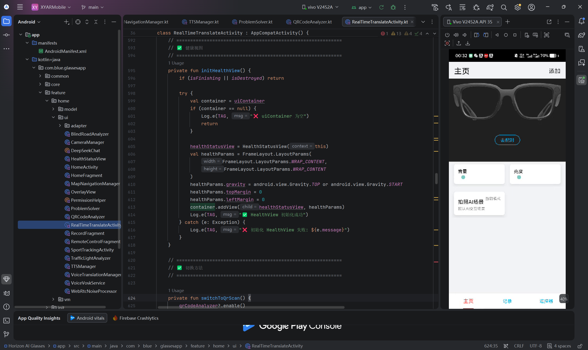
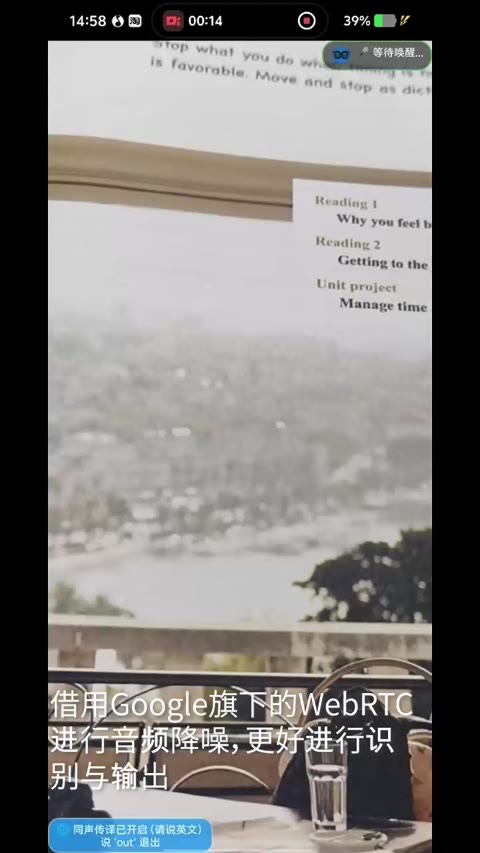
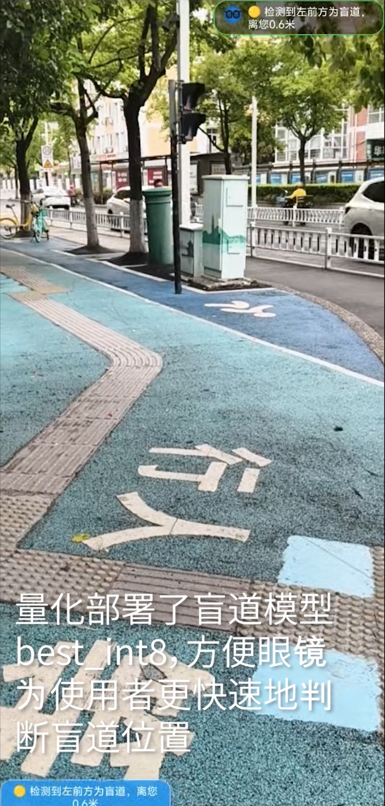
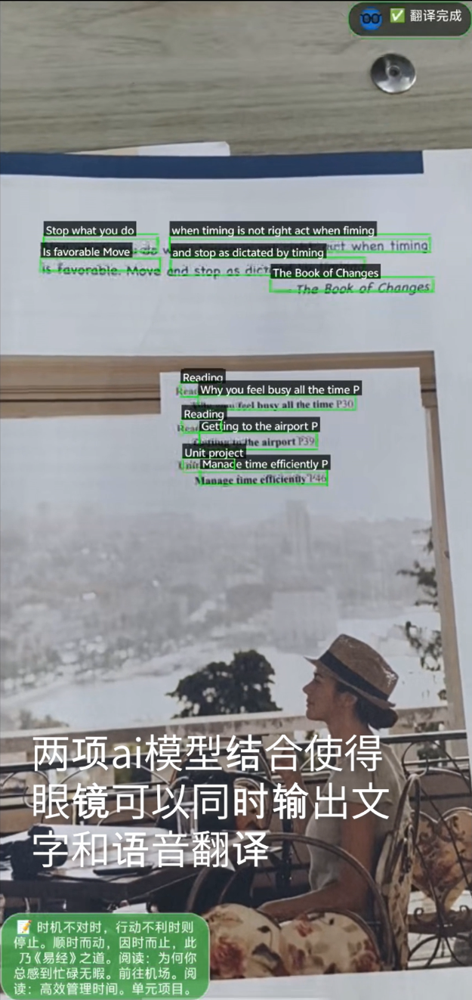
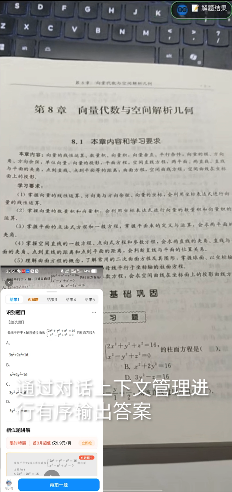
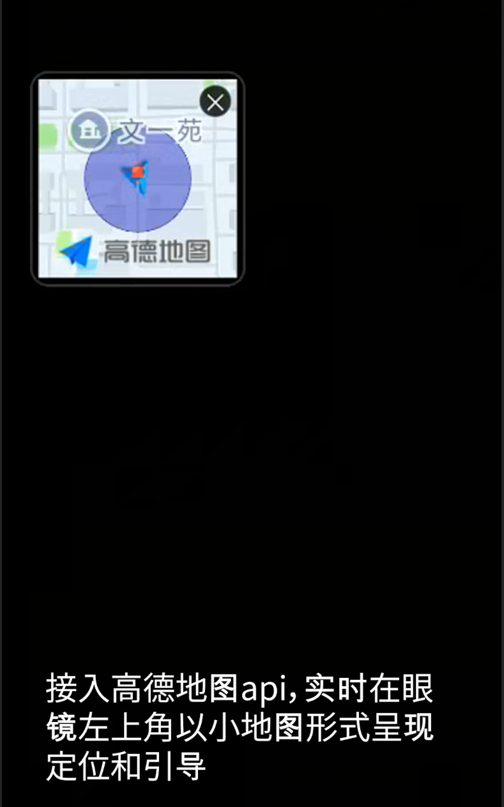
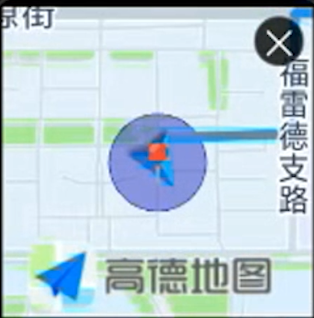
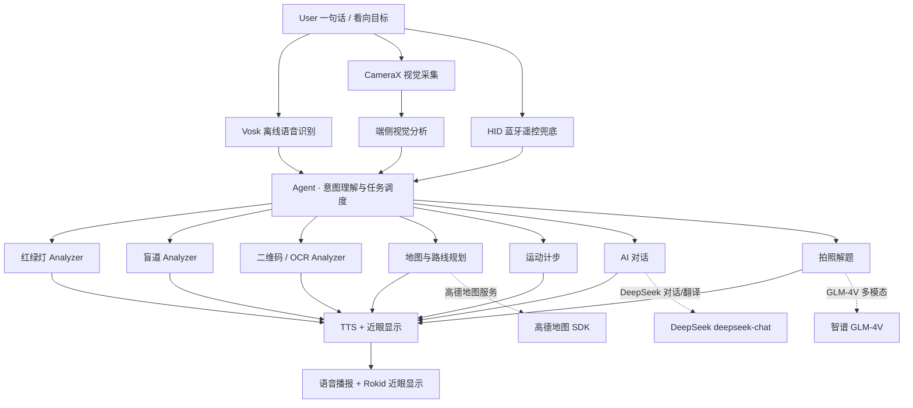

# Horizon AI Glasses

> AI-powered smart glasses assistant for hands-free, context-aware interaction.

[简体中文](./README.md) · English


---

**Horizon AI Glasses** is a **voice-first, edge-cloud collaborative** assistant that runs on an **Android phone + Rokid AI glasses**.

When you wear glasses, your hands and your sight are usually occupied. This project merges "seeing" and "understanding" back into your line of sight: you say a single sentence, and the system handles intent understanding and task routing, dispatching across offline speech recognition (Vosk), on-device vision (TensorFlow Lite), cloud LLMs (DeepSeek / Zhipu GLM) and map services (AMap), then returns results through **TTS voice** and **near-eye display** — no reaching for your phone, no looking down.

The current version has integrated the core pipelines of glasses connection, offline Chinese/English speech recognition, traffic-light & blind-path detection, map location & route planning, photo-based problem solving, and translation / simultaneous interpretation. A total of **27 voice actions** are scheduled through a single entry point.

---

## Demo / Product Preview

**Android app UI** (real screenshot from a device)



<details>
<summary><b>🎬 Open the demo (click to expand)</b></summary>

**Full demo video** (click the thumbnail to play):

[](docs/video/Horizon-AI-Glasses.mp4)

**App feature screenshots** (click the title above to collapse):

| Blind-path detection (on-device) | Text translation | Photo problem-solving (GLM-4V) |
| :---: | :---: | :---: |
|  |  |  |

| AMap location | Route planning & navigation |
| :---: | :---: |
|  |  |

</details>

> All screenshots are from the Android phone app; on the glasses side, custom views are rendered through the CXR-M SDK for near-eye display.

---

## Why Horizon AI Glasses

Traditional mobile information access is a long chain:

```text
Take out phone → Open app → Find the feature → Point at the target → Wait → Look down to confirm
```

For users wearing glasses with their hands occupied (cycling, accessibility travel, cross-language conversation, lab work), every step of that chain is a burden.

Horizon AI Glasses compresses it to:

```text
Say one sentence / look at the target
        ↓
The system understands the task (local rules + LLM intent analysis)
        ↓
The agent calls the matching capability (on-device vision / cloud LLM / map service)
        ↓
Voice + near-eye display feedback
```

The design principle is simple: **privacy-sensitive, real-time tasks stay on the device; complex dialogue and computation-heavy tasks go to the cloud.**

---

## Core Features

Every capability below has a concrete implementation in `app/src/main/java/com/blue/glassesapp/`.

### 🚦 Accessibility travel (on-device)
- **Traffic-light detection**: TensorFlow Lite runs a YOLOv8 float32 model recognizing red / green / yellow; it implements Letterbox preprocessing, confidence threshold, NMS and **3-frame stability filtering** to suppress single-frame false positives.
- **Blind-path detection**: TensorFlow Lite runs an int8-quantized model, computes the horizontal deviation of the tactile path from the frame center, and produces directional hints ("on the path / ~X m on the left / right").
- Both run entirely on-device: raw frames never leave the phone, and they work offline.

### 🌐 Cross-language communication (cloud)
- **Text translation**: CameraX frame → ML Kit Chinese OCR → DeepSeek `deepseek-chat` translation, announced via TTS.
- **Simultaneous interpretation**: switches Vosk to the English model for continuous recognition, translates in real time; say "out / 关闭同传" to exit.

### 🗺️ Map & navigation (cloud SDK)
- AMap: location, POI search, driving route planning, route drawing, with **2D / 3D view switching** (the 3D camera follows the driving heading); route results are announced via TTS.
- Note: the current implementation is "map + route planning + 2D/3D view". Turn-by-turn voice guidance from the AMap **Navi** SDK is not yet integrated (see [Project Status](#project-status)).

### 🤖 AI chat & photo problem-solving (cloud)
- **AI chat**: DeepSeek `deepseek-chat` (`temperature` 0.7 for conversation / 0.3 for intent extraction).
- **Photo problem-solving**: Zhipu **GLM-4V-plus** multimodal model — the frame is JPEG-compressed, base64-encoded and uploaded so the model can read both image and text and give step-by-step answers.

### 🎤 Voice interaction loop (on-device)
- **Vosk offline Chinese/English ASR**: `AudioRecord` at 16 kHz mono PCM, RMS energy detection + silence timeout to delimit an utterance, with partial results during speech.
- **TTS / ASR coordination**: recording pauses while TTS speaks and resumes afterwards, avoiding feedback between speaker and microphone.
- **Noise gating**: `WebRtcNoiseProcessor` performs energy-threshold voice-activity detection (VAD). Note: due to the WebRTC Java API limitation, the implementation falls back to a VAD-based approach (see code comments).

### 💳 QR payment
- ML Kit barcode scanning; aim at a payment code to read it; started/stopped by voice.

### 🏃 Sports & health
- Step counting from the accelerometer (simplified detector in `VoiceTranslationManager`) and from `STEP_COUNTER / STEP_DETECTOR` sensors (`SportTrackingActivity`), with distance estimation.
- Health display currently uses **simulated demo data** (heart rate / blood oxygen / fatigue), not real physiological readings.

### 📒 Interaction records
- GreenDAO local database stores each voice command, recognized action, timestamp and result status for history queries.

---

## How the Agent Works

> In this project the Agent is the **intent-understanding, capability-scheduling and process-orchestration hub** — not a fully autonomous agent.

```text
Voice input
   ↓
Vosk offline speech recognition (16 kHz / RMS silence detection / zh-en models)
   ↓
Intent understanding
   ├── Local fast matching (high-frequency commands: sports / 3D navigation / exit simultaneous…)
   └── DeepSeek intent analysis (LLM picks from 27 predefined actions; only the recognized text is sent)
   ↓
Task routing (executeIntent)
   ↓
Tool invocation
   ├── On-device: traffic light / blind path / QR / OCR / step count / TTS
   └── Cloud: DeepSeek chat & translation / Zhipu problem-solving / AMap navigation
   ↓
Result expression (TTS + near-eye display)
```

Key design points:

- **Two-level intent strategy**: high-frequency commands match local rules directly (low latency, zero cost); unmatched commands go to DeepSeek, which picks from a **predefined action set**. **The LLM only handles semantic understanding; execution is always controlled by code**, so behavior stays predictable and fallible.
- **Minimal-data principle**: intent analysis uploads only the recognized text, never raw audio; problem-solving uploads only a compressed single frame, never the continuous stream.
- **27 actions**: `translate`, `simultaneous`, `navigate`, `navigate_3d`, `pay`, `traffic_light`, `blind_road`, `solve_problem`, `start_chat`, `take_photo`, `toggle_recording`, `start_sport`, `show_map`, `close_all` and more (full list in [`docs/architecture/voice-actions.md`](docs/architecture/voice-actions.md)).

---

## System Architecture

A bottom-up four-layer architecture:



| Layer | Responsibility | Technology |
| --- | --- | --- |
| Application | Scenario-facing feature organization | Home / real-time translation / sport / remote-control pages, 27 voice actions |
| Understanding | Intent understanding & task routing | Local rules + DeepSeek intent analysis |
| Capability | Concrete capability outputs | Vosk · ML Kit · TensorFlow Lite · TTS · WebRTC-VAD |
| Device connection | Data sources & interaction | CXR-M SDK · Bluetooth HID · CameraX · SensorManager |

Layering pays off through **capability reuse**: one CameraX pipeline serves preview / analysis / recording, one TTS serves navigation / traffic-light / blind-path / translation / chat announcements, and one GreenDAO database serves both records and business data.

See [`docs/architecture/architecture.md`](docs/architecture/architecture.md) for details.

---

## Edge-Cloud Collaboration

The edge-cloud split is the core design decision, based on **latency / data sensitivity / capability ceiling**:

| Capability | Edge / Cloud | Implementation | Rationale |
| --- | --- | --- | --- |
| Speech recognition | Edge | Vosk + AudioRecord | hands-free input needs low latency & offline use; raw audio is personal |
| Traffic-light / blind-path | Edge | YOLOv8 TFLite | real-time hints; raw frames contain environment & people |
| QR / OCR | Edge | ML Kit | simple, real-time, no need to upload frames |
| Speech synthesis | Edge | Android TTS | immediate feedback channel |
| Step counting | Edge | accelerometer / STEP sensors | local sensor data |
| Chat / intent analysis | Cloud | DeepSeek `deepseek-chat` | needs LLM language ability; **only recognized text is sent** |
| Translation / simultaneous | Cloud | DeepSeek API | needs LLM translation ability |
| Photo problem-solving | Cloud | Zhipu GLM-4V | needs multimodal reasoning; **only a compressed single frame is sent** |
| Map / route planning | Cloud | AMap SDK | needs professional map data & services |

**Offline fallback**: when the network is down, traffic-light, blind-path, QR, basic OCR and speech recognition still sustain the core experience; cloud chat and problem-solving re-engage once the network recovers.

---

## Technology Stack

| Area | Technology | Purpose |
| --- | --- | --- |
| Platform | Android (minSdk 28 / targetSdk 33 / compileSdk 36) · Kotlin 2.1 | app |
| Device | Rokid CXR-M SDK 1.0.3 · Bluetooth HID | glasses connection, near-eye display, remote |
| Speech | Vosk (Kaldi) zh-en offline models · Android TTS | offline recognition / synthesis |
| Vision | CameraX · ML Kit (Chinese OCR + barcode) · TensorFlow Lite | capture / OCR / QR |
| Models | YOLOv8 (traffic-light float32 + blind-path int8, TFLite) | on-device object detection |
| Cloud AI | DeepSeek `deepseek-chat` · Zhipu GLM-4V-plus | chat / intent / translation / solving |
| Maps | AMap SDK (3D map + search + location) | location / POI / routes |
| Data / UI | GreenDAO · QMUI · EventBus · Glide | local records / UI |

---

## Project Structure

```
Horizon-AI-Glasses/
├── app/                          # Android application module
│   ├── src/main/java/com/blue/glassesapp/
│   │   ├── core/                 # CXR connection, Bluetooth HID, database, permissions, utils
│   │   ├── common/               # shared models, data binding, widgets
│   │   └── feature/
│   │       ├── init/             # launch
│   │       ├── scanblueroorh/    # Bluetooth scan & pairing
│   │       └── home/             # main: voice routing, vision analysis, translation, navigation, sport
│   ├── src/main/assets/
│   │   ├── model/ model_en/      # Vosk zh/en models (not tracked by git — see docs)
│   │   ├── blindpath/            # blind-path int8 model (tracked)
│   │   └── traffic/              # traffic-light float32 model (tracked)
│   └── src/main/res/             # layouts / resources / raw (incl. Rokid license placeholder)
├── gradle/                       # wrapper + version catalog
├── docs/
│   ├── images/                   # real screenshots used in the README
│   ├── architecture/             # architecture notes, voice-action list
│   ├── development/              # build / configuration / required SDK files
│   └── competition/              # competition materials (project report, etc.)
├── README.md / README_EN.md
├── LICENSE / SECURITY.md / CONTRIBUTING.md / THIRD_PARTY_NOTICES.md
└── build.gradle / settings.gradle / gradle.properties
```

---

## Getting Started

### Requirements

| Item | Requirement |
| --- | --- |
| JDK | 17+ (required by AGP 8.9.1) |
| Android Studio | version supporting AGP 8.9 / Gradle 8.11.1 |
| Android SDK | `compileSdk 36`, `minSdk 28` (Android 8.0+) |
| Device | an arm64-v8a Android phone (physical device) |
| Glasses | Rokid Glasses + CXR-M SDK auth (`.lc` file + `CLIENT_SECRET`) |

### Steps

```text
1. Clone the repository
2. Open the project in Android Studio
3. Restore the required SDK / model files (below & docs/development/)
4. Configure local.properties (copy local.properties.example)
5. Connect an arm64 Android device
6. Build & install
```

### Restore required SDK / model files

The following files are **not in this repository** due to licensing and size limits (see `THIRD_PARTY_NOTICES.md`). Restore them before building, following [`docs/development/required-sdk-files.md`](docs/development/required-sdk-files.md):

| File | Target directory | Source |
| --- | --- | --- |
| AMap SDK AAR | `app/src/main/assets/maps/` | AMap open platform |
| AMap native libs (`libAMapSDK_NAVI*.so`, `libapssdk.so`, …) | `app/src/main/jniLibs/arm64-v8a/` | AMap open platform |
| Rokid native libs (NeonUI / nui / openssl, …) | `app/src/main/jniLibs/arm64-v8a/` | Rokid developer portal |
| Rokid device license `.lc` | replace `app/src/main/res/raw/a1e15aabfb1e4a88bbaf97e31121a84b.lc` (currently a placeholder) | Rokid developer portal |
| Vosk Chinese model | `app/src/main/assets/model/` | alphacephei.com/vosk/models |
| Vosk English model | `app/src/main/assets/model_en/` | alphacephei.com/vosk/models |

> The blind-path (`blindpath/`) and traffic-light (`traffic/`) TFLite models are self-trained for this project and are distributed with the repository.

### Build

```bash
# Windows
gradlew.bat assembleDebug
# macOS / Linux
./gradlew assembleDebug
```

---

## Configuration

Cloud capabilities (chat, translation, solving, maps, device auth) need API keys. **Keys live only in your local `local.properties` (git-ignored) — never commit them.**

```bash
cp local.properties.example local.properties   # then fill in your keys
```

```properties
DEEPSEEK_API_KEY=your_deepseek_api_key_here      # DeepSeek: chat / translation / simultaneous / intent
GLM_API_KEY=your_glm_api_key_here                # Zhipu: photo problem-solving (GLM-4V)
AMAP_API_KEY=your_amap_api_key_here              # AMap: maps / location / route planning
ROKID_CLIENT_SECRET=your_rokid_client_secret_here  # Rokid: device auth
sdk.dir=/path/to/your/Android/Sdk                # your local Android SDK path
```

Full details in [`docs/development/configuration.md`](docs/development/configuration.md).

---

## Project Status

### ✅ Implemented (verifiable in code)

- [x] Rokid glasses connection: Bluetooth discovery / pairing / CXR auth / custom views (near-eye display) / volume-brightness-battery listeners
- [x] Vosk offline Chinese/English ASR + TTS loop (recording pauses while TTS speaks)
- [x] Two-level voice intent scheduling (local match + DeepSeek analysis), 27 actions
- [x] Traffic-light detection (YOLOv8 float32, 3-frame stability)
- [x] Blind-path detection (YOLOv8 int8, deviation-based directional hints)
- [x] QR scanning / Chinese OCR (ML Kit)
- [x] Text translation & simultaneous interpretation (DeepSeek)
- [x] AI chat (DeepSeek) & photo problem-solving (Zhipu GLM-4V)
- [x] AMap: location / POI search / route planning / 2D·3D views
- [x] Sport step counting (accelerometer / STEP sensors)
- [x] Interaction records (GreenDAO)
- [x] Bluetooth HID remote management (`BluetoothHidManager`) & remote-control UI

### 🚧 In progress / known limitations (honest)

- Navigation is "route planning + 2D/3D view"; **the AMap Navi turn-by-turn voice guidance is not yet integrated**
- `WebRtcNoiseProcessor` is an energy-threshold VAD noise gate (not full WebRTC NS/AEC)
- Traffic-light / blind-path detection runs real on-device inference, but the Activity display text is partly hardcoded and does not surface the model's detailed confidence output
- Health display uses **simulated data** (not real physiological readings)
- The Manifest declares `BluetoothHidService`, but that Service class is not implemented yet (the HID management itself is implemented in `core/utils/hid/`)
- Cloud API keys currently live in the client app (prototype stage); they should move to a server-side proxy before production

### 🗺️ Roadmap

- Wrap each capability in a standard tool protocol so the Agent can decide tool-call order, retry and result summarization — evolving from a "multi-scenario voice assistant" toward a "personal agent"
- Build long-term memory (frequent places / languages / interaction habits)
- Integrate real physiological sensors to upgrade health display to real monitoring
- Pilot with accessibility-travel, travel and sports users; measure E2E latency, recognition accuracy and false-positive rate

---

## Safety & Privacy

- **No keys in the repo**: all API keys / secrets are injected from your local `local.properties` (git-ignored); the repository ships only a placeholder template.
- **Minimal data upload**: raw audio and continuous video never leave the device by default; intent analysis sends only recognized text, and solving sends only one compressed frame.
- **Edge-first**: traffic-light, blind-path, QR, OCR and speech recognition run on-device.
- **Least privilege**: camera / mic / location / Bluetooth / media permissions are requested only when a scenario needs them (`PermissionHelper`).
- **AI assistance ≠ professional judgment**: recognition and solving results are assistive only and must not replace safety, medical or traffic judgment.
- Security policy: [`SECURITY.md`](SECURITY.md).

---

## Competition Highlights

- **Display-free interaction**: voice as the primary entry, HID Bluetooth remote as fallback, near-eye display + TTS as output — "look up and see, speak and reach".
- **Edge-cloud collaboration**: "privacy-sensitive & real-time → edge, complex & computation-heavy → cloud"; core recognition stays usable offline.
- **Unified agent scheduling**: two-level local-rules + LLM intent analysis, 27 actions under one entry; the LLM understands, the code executes.
- **First-person perception**: one CameraX pipeline feeds traffic-light / blind-path / QR / OCR on-device analysis.
- **Accessibility use case**: traffic-light and blind-path hints for visually impaired travel, offline capable.

---

## Documentation

| Document | Description |
| --- | --- |
| [README.md](./README.md) | 中文 README |
| [docs/architecture/architecture.md](docs/architecture/architecture.md) | four-layer architecture & module design |
| [docs/architecture/voice-actions.md](docs/architecture/voice-actions.md) | 27 voice actions & example commands |
| [docs/development/required-sdk-files.md](docs/development/required-sdk-files.md) | SDK / model files to fetch & where to put them |
| [docs/development/configuration.md](docs/development/configuration.md) | key configuration & local build |
| [docs/development/rokid-device-license.md](docs/development/rokid-device-license.md) | Rokid `.lc` license file |
| [docs/competition/](docs/competition/) | competition materials (project report, etc.) |
| [THIRD_PARTY_NOTICES.md](THIRD_PARTY_NOTICES.md) | third-party components & licenses |
| [CONTRIBUTING.md](CONTRIBUTING.md) | contribution guide |
| [SECURITY.md](SECURITY.md) | security policy |

---

## Contributing

Issues and pull requests are welcome. Please read [CONTRIBUTING.md](CONTRIBUTING.md) first.

## License

The project code is open-sourced under the [MIT License](LICENSE). **Note**: some third-party components in this repository (Rokid SDK, AMap SDK, Vosk models, TFLite models, etc.) remain under their own original licenses and terms — they are not covered by MIT. See [THIRD_PARTY_NOTICES.md](THIRD_PARTY_NOTICES.md).
