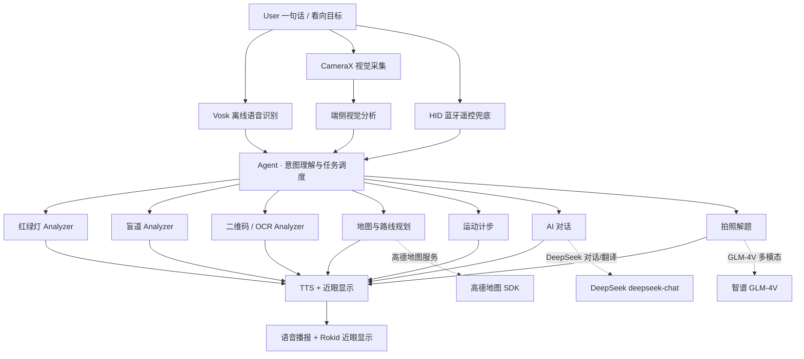

# System Architecture

Horizon AI Glasses uses a bottom-up four-layer architecture. The goal is
**capability reuse**: one CameraX pipeline serves preview / analysis /
recording, one TTS serves every announcement channel, and one GreenDAO
database serves records and business data.

## Layers

| Layer | Responsibility | Key classes / modules |
| --- | --- | --- |
| Application | scenario-facing feature organization | `HomeActivity`, `HomeFragment`, `RealTimeTranslateActivity`, `SportTrackingActivity`, `RemoteControlFragment` |
| Understanding | intent understanding & task routing | `VoiceTranslationManager` (local rules + DeepSeek `analyzeIntent`) |
| Capability | concrete capability outputs | `VoiceVoskService`, `TrafficLightAnalyzer`, `BlindRoadAnalyzer`, `QRCodeAnalyzer`, `OCRAnalyzer`, `TTSManager`, `DeepSeekChat`, `ProblemSolver`, `MapNavigationManager` |
| Device connection | data sources & interaction | `CxrUtil` (CXR-M SDK), `BluetoothHidManager`, CameraX, SensorManager |

## Module map

| Module | File | What it does |
| --- | --- | --- |
| Voice entry & routing | `feature/home/ui/VoiceTranslationManager.kt` | command handling, local fast matching, DeepSeek intent analysis, dispatch to all capabilities |
| Offline ASR | `feature/home/ui/VoiceVoskService.kt` | `AudioRecord` 16 kHz PCM → RMS VAD → Vosk `Recognizer`, zh/en model switching, `WebRtcNoiseProcessor` noise gating |
| Traffic-light detection | `feature/home/ui/TrafficLightAnalyzer.kt` | TFLite YOLOv8 float32, Letterbox, NMS, 3-frame stability, red/green/yellow |
| Blind-path detection | `feature/home/ui/BlindRoadAnalyzer.kt` | TFLite YOLOv8 int8, deviation from frame center, directional hints |
| QR / OCR | `feature/home/ui/QRCodeAnalyzer.kt`, `RealTimeTranslateActivity.kt` | ML Kit barcode + Chinese text recognition |
| Translation / simultaneous | `feature/home/ui/VoiceTranslationManager.kt` | DeepSeek `chat/completions`, OCR-translation and simultaneous flows |
| Map & route | `feature/home/ui/MapNavigationManager.kt` | AMap init, privacy-consent, location, POI search, `RouteSearch`, 2D/3D camera views |
| AI chat | `feature/home/ui/DeepSeekChat.kt` | `deepseek-chat`, temp 0.7 (chat) / 0.3 (intent extraction) |
| Photo solving | `feature/home/ui/ProblemSolver.kt` | Zhipu GLM-4V-plus, JPEG-compress + base64, multimodal prompt |
| TTS | `feature/home/ui/TTSManager.kt` | `TextToSpeech` queue, `UtteranceProgressListener` → pause/resume recording |
| Glasses connection | `core/utils/CxrUtil.kt` | `CxrApi.initBluetooth`, `openCustomView`, volume/brightness/battery listeners |
| HID remote | `core/utils/hid/BluetoothHidManager.kt`, `feature/home/ui/RemoteControlFragment.kt` | HID keyboard/remote reports over Bluetooth |
| Records | `core/db/DBManager.kt` | GreenDAO `GlassesRecordModelDao` |

## Data flow of one voice command

1. `VoiceVoskService` captures audio and produces recognized text.
2. `handleVoiceCommand()` first tries local fast matching (sports, 3D
   navigation, simultaneous-exit).
3. Otherwise `analyzeIntent()` calls DeepSeek with the recognized text only,
   asking it to pick one of 27 predefined actions.
4. `executeIntent()` routes to the matching capability module.
5. Results are announced through `TTSManager` (and custom views are pushed to
   the glasses via CXR-M SDK).

The LLM only classifies intent; all execution stays in deterministic code, so
behavior is predictable and can always fall back to plain chat.
